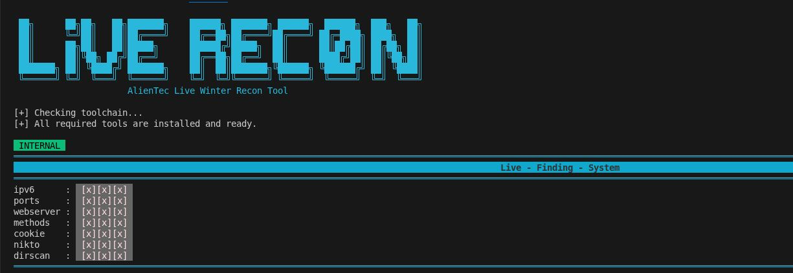
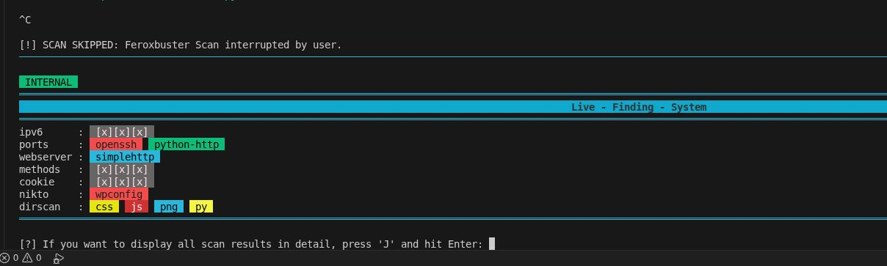

<p align="center">
  
</p>
 

<p align="center">
  <b>Autonomous Recon Framework for Offensive Security</b><br>
  Hands-off scanning · Live findings · Senior-grade workflows
</p>

<p align="center">
  
  
  
  
  
</p>


---

# 🧊 Recon Monster – Winter Tool


Autonomes Recon-Framework für reale Offsec-Workflows.  
Entwickelt für **Hands-off-Scanning**, **Live-Findings in Echtzeit** und **maximale Kontrolle ohne Micromanagement**.

Live-Recon läuft selbstständig durch alle Recon-Phasen, bewertet Ergebnisse live und erlaubt gezieltes Eingreifen – ohne den Scanfluss zu zerstören.

---

## 🔥 Kernidee

**Starten → beobachten → nur eingreifen, wenn nötig**

- Vollständig **autonomer Recon-Ablauf**
- **Live-Finding-System** mit sofortiger Klassifizierung
- **Kein Warten auf Reports** – Findings erscheinen während des Scans
- **Scans überspringbar** ohne Abbruch der Pipeline
- **Detaillierte Analyse auf Abruf**, nicht erzwungen

---

## ⚙️ Autonomer Scan-Workflow

Live-Recon führt die Scans **sequenziell und selbstständig** aus:

1. HTTP / Methoden-Analyse (curl)
2. Nmap TCP Full Scan
3. Nmap UDP Scan
4. Nmap SCTP Hostscan
5. Webserver-Identifikation
6. Nikto Web Scan
7. Feroxbuster Directory Scan
8. Live-Aggregation aller Findings
9. Optionale Detailansicht

---

Kein manuelles Triggern einzelner Module nötig.

---



## 🚀 Usage

Run Live Recon by specifying a target IP address or hostname:

```bash
/bin/python3 /root/recontool_project/live_recon.py --ip <ip>
```

---

## ⚙️ Parameters

### `--ip <TARGET>`

Target IP address or hostname to scan.

**Example:**

```bash
/bin/python3 live_recon.py --ip example.com

```
---
 

## 📡 Live-Finding-System (Echtzeit)

Das **Live-Finding-Banner** ist das Herzstück des Tools.

- Aktualisiert sich **nach jedem Scan**
- Zeigt **sofort erkannte Ergebnisse**
- Einheitlich gelabelt
- Farblich hervorgehoben
- Kein Parsing am Ende notwendig

### Beispiel (intern)

INTERNAL<br>
════════════════════════════════════════════════════════<br>
Live - Finding - System<br>
════════════════════════════════════════════════════════<br>
ipv6 : [x][x][x]<br>
ports : openssh python-http<br>
webserver : simplehttp<br>
methods : [x][x][x]<br>
cookie : [x][x][x]<br>
nikto : wpconfig<br>
dirscan : css html js png py<br>
════════════════════════════════════════════════════════<br>
<br><br>
---

## 🌐 Automatic Target Classification (External vs. Internal)

Live Recon erkennt **vollautomatisch**, ob es sich beim Ziel um eine **interne** oder **externe** IP-Adresse handelt.  
Keine Flags, keine Konfiguration, keine manuellen Entscheidungen.

### 🔍 How it works

Beim Start analysiert Live Recon die Zieladresse:

- **Interne Targets**
  - RFC1918 IPv4 (z. B. `10.0.0.0/8`, `172.16.0.0/12`, `192.168.0.0/16`)
  - Loopback (`127.0.0.1`)
  - Link-Local (`169.254.0.0/16`)
  - IPv6 Link-Local (`fe80::/10`)

- **Externe Targets**
  - Öffentliche IPv4/IPv6-Adressen
  - Internet-exponierte Hosts
  - Cloud- und WAN-Ziele

Die Erkennung erfolgt **vor dem ersten Scan** und beeinflusst automatisch:
- Scan-Reihenfolge
- Module
- Timeouts
- Darstellung im Live-Banner

---

## 🖥️ Live Banner – Target Mode Indicator

Der erkannte Modus wird **permanent im Live-Finding-Banner angezeigt**.

### Example: External Target


---
➡️ **Relevantes sofort sichtbar**, ohne Logs zu lesen.



---

## 🎨 Farb- & Label-Logik

- Services, Ports, Webserver → klar benannt
- Web-Findings (z. B. `wp-config.php`) → sofort markiert
- Dirscan-Typen → nach Dateiendungen gruppiert
- Konsistenter Status über alle Scans

Kein Noise. Keine Dopplungen.

---

## ⏭️ Scan überspringen (STRG + C)

Jeder laufende Scan kann **gezielt übersprungen** werden:


Ergebnis:

- Aktueller Scan wird sauber beendet
- Tool läuft **automatisch mit dem nächsten Modul weiter**
- Live-Finding-System bleibt aktiv
- Kein Abbruch des gesamten Recon-Flows

Beispiel:
[!] SCAN ABGEBROCHEN: Feroxbuster Scan übersprungen.


Ideal bei langen Scans oder klarer Priorisierung.

---

## 🔍 Detailansicht auf Abruf (Taste `J`)

Am Ende des autonomen Runs:
[?] Wenn Sie alle Scans detailliert anzeigen lassen wollen, geben Sie 'J' ein:


Mit `J` erhältst du:

- Vollständige Nikto-Reports
- Cookie-Dumps
- Feroxbuster JSON & Text
- Strukturierte Ausgabe pro Modul
- Reproduzierbare Findings

➡️ **Details nur dann**, wenn du sie brauchst.

---

## 📁 Output & Reports

Automatisch erzeugt:

- `cookies.txt`
- `nikto.txt`
- `nikto.json`
- `feroxbuster.json`
- `nmap_*.json`
- Strukturierte Log-Ordner pro Target

Geeignet für Reporting, Nachanalyse und Tool-Chains.

---

## 🧠 Warum Live-Recon?

- Kein Tool-Spamming
- Kein blindes Durchrauschen
- Kein Warten auf Endreports
- Entwickelt aus **echten Recon-Sessions**
- Gedacht für **Senior-Workflows**

Recon Monster ist kein Spielzeug.  
Es ist ein **Recon-Operator**, der für dich arbeitet.

---

## ❄️ Winter Edition – Fokus

- Stabilität
- Lesbarkeit
- Live-Feedback
- Autonomie
- Kontrolle ohne Overhead

---

## 🚀 Einsatzgebiet

- CTF Recon
- Initial Access Recon
- Lab-Enumeration
- Pre-Exploitation Mapping
- Red-Team-Vorbereitung
